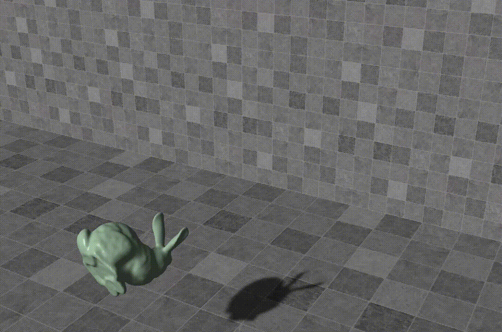
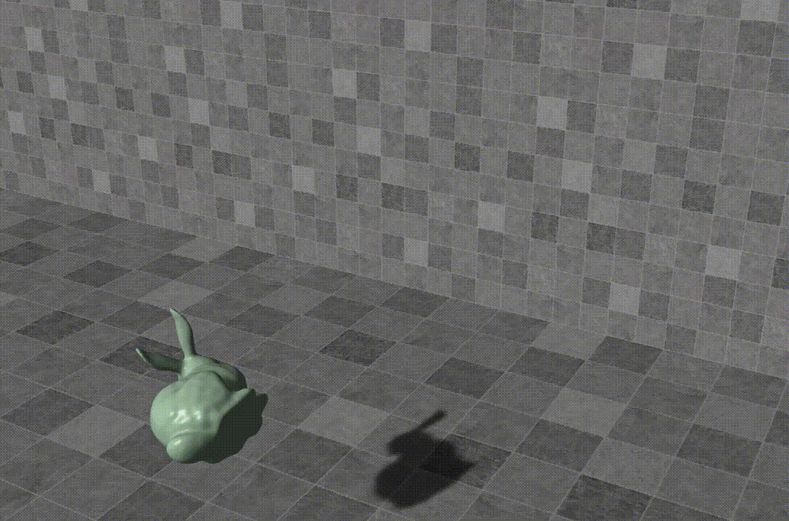

# GAMES103

The assignments of GAMES103 (Introduction to Physically based Animation) whose instructor is Huamin Wang, if you are interested, please refer to http://games-cn.org/games103/ for more information. this lecture mainly includes six parts: rigid body dynamics and contacts, mass-spring systems, constrained approaches, collision handling, soft body dynamics(finite element method) and fluid dynamics.

## Angry Bunny

In this assignment, I have implemented rigid body dynamics, and to solve the contacts between the bunny and the surrounding environment, I use two methods: impulse method and shape matching method.

### Impulse Method

Here is the final result of impluse method:


Here are the steps to implement this method:

1. For every vertex, we get its position by (where *X* and *R* are the bunny's global position and rotation,  $r_i$ is the local position of very vertex):

$$
X_i = X + Rr_i
$$

2. And then we test every vertex whether the SDF function is greater than 0, if yes, we are done, otherwise go to step 3.

3. For every vertex, we get its velocity by (where $V$ and $w$ are the velocity and angular velocity of the bunny and *R* is the rotation matrix of the bunny):

$$
V_i = V + w \times Rr_i
$$

4. And then we test every vertex's direction whether it moves close to or away from collision object by the following formula, if it's the latter case, we are done, otherwise go to step 5.

$$
v_i * N < 0
$$

5. We compute the new velocity of the vertex, by splitting the vertex's velocity into two parts: one that is parallel to $N$, the other that is perpendicular to $N$, and then handle them respectively.


$$
v_{N, i} = (v_i * N)N
$$

$$
v_{T, i} = v_i - v_{N, i}
$$

$$
a = max(1 - \mu_T(1 + \mu_N)||v_{N,i}||/||v_{T, i}||, 0)
$$

$$
v_{N, i}^{new} = -\mu_Nv_{N, i}
$$

$$
v_{T, i}^{new} = av_{T, i}
$$

$$
v_i^{new} = v_{N, i}^{new} + v_{T, i}^{new}
$$

6. And then we compute the impulse **j** by the  $v_i^{new}$ and $v_i$ (where $I$ is the inertia matrix of the bunny in the reference state):

$$
K = \dfrac{1}{M} * \mathbb{I} - (Rr_i)^* I^{-1} (Rr_i)^*
$$

$$
j = K^{-1}(v_i^{new} - v_i)
$$

Here we use $r^*$ to represent the cross product matrix of *r*:

$$
r^* =
\begin{bmatrix}
0 & -r_z & r_y\\
r_z & 0 & -r_x\\
-r_y & r_x & 0
\end{bmatrix}
$$

That is to say:

$$
r \times q =
\begin{bmatrix}
r_y * q_z - r_z * q_y\\
r_z * q_x - r_x * q_z\\
r_x * q_y - r_y * q_y\\
\end{bmatrix} \\
=\\
\begin{bmatrix}
0 & -r_z & r_y\\
r_z & 0 & -r_x\\
-r_y & r_x & 0\\
\end{bmatrix}
\begin{bmatrix}
q_x\\
q_y\\
q_z\\
\end{bmatrix}
= r^*q
$$
   
   
7. Finally, we update the *v* and *w* using impuse computed from the former step:

$$
v = v + \dfrac{1}{M}j
$$

$$
w = w + I^{-1}(Rr_i\times j)
$$
   

### Shape Matching Method

Here is the final result of shape matching method:

A difference between this method and the first one is that, to tranform the bunny, the first method is modifying the bunny's position and orientation, however, In this method, the bunny's poisition and orientation are set to identity, it modifies bunny vertices position for every frame, which maybe a little clumsy and time consuming. another side effect that is prone to ignore is that the shading is wrong caused by not updating the normal of all vertices. so you may add several lines of code in the Update_Mesh method to solve this problem. note how the normals are updated. (caution: do not apply the translation to the normal)

```C#
void Update_Mesh(Vector3 c, Matrix4x4 R, float inv_dt)
   	{
   		for(int i=0; i<Q.Length; i++)
		{
			Vector3 x=(Vector3)(R*Q[i])+c;

			V[i]+=(x-X[i])*inv_dt;
			if(i == 0) {
				Debug.Log("UpdateMesh " + V[i]);
			}
			X[i]=x;
		}
		for(int i = 0; i < N.Length; i++) {
			current_normals[i] = R * N[i];
		}
		Mesh mesh = GetComponent<MeshFilter>().mesh;
		mesh.vertices=X;
		mesh.normals = current_normals;
   	}
```

there is a common problem in these two implementations, which is caused by delta time provided by the based code, the delta time in the base code is a fixed number 0.016 seconds standing for the time executed every frame. If you have a fast CPU, it may take only 3 or 4 millliseconds to exectue a frame, if this is the case, the bunny will have a higher velocity than you want. as a result, using the actual delta time will solve this problem perfectly.
In Unity, you can use this function to get the delta time in the Update function.

```C#
dt = Time.deltaTime;
```
